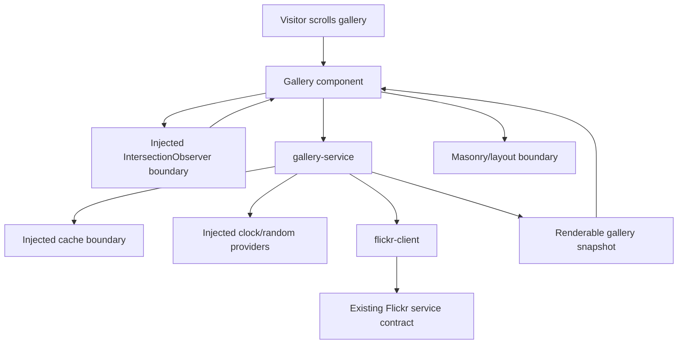

# Repository Renovation Spec

## Problem Statement

The portfolio repository is a working client-side Vue portfolio, but its repository health does not match the standards documented in the project. The current validation wrapper returns false green results, there is no automated test suite, CI deploys without the desired quality gates, direct dependencies are stale, and user-facing gallery behavior is concentrated in shallow component code that is difficult to test safely.

The user wants a full repository renovation, not a narrow tooling patch. Everything identified in the handoff is in scope, as long as the renovation preserves the current user experience and keeps the external Flickr backend contract exactly stable. The main value is to make the repository trustworthy: behavior should be locked with tests, validation should run through real `run.sh` gates, dependency updates should be automated safely, and dead code should be removed after feature parity is proven.

## Solution

Renovate the repository in behavior-preserving phases. First remove false-green validation by adding real test, check, build, format, e2e, CI, Dependabot, automerge, and branch-protection gates. Then characterize the current gallery and About behavior before refactoring. After behavior is locked, extract a deep gallery service with injected dependencies, migrate the Flickr client to native `fetch`, remove unnecessary dependencies and all TypeScript, modernize Vite/router/framework configuration, replace the abandoned masonry dependency with CSS-only masonry as close to current behavior as possible, and clean up unused code after parity is green.

Production behavior must remain root-hosted at `https://floydkretschmar.com/`, but Vite and Vue Router base handling must become Vite-native. The gallery and About page must remain visually and behaviorally equivalent to the current production experience. No new user-facing feature, error UI, or portfolio content rewrite is part of this renovation.

## User Stories

1. As the repository owner, I want `run.sh` validation commands to execute real checks, so that false-green repository states cannot hide broken behavior.
2. As the repository owner, I want `run.sh test` to run unit and integration tests only, so that behavior coverage is separated from e2e confidence.
3. As the repository owner, I want `run.sh e2e-tests` to run Playwright flows, so that core UI behavior is verified like a user would experience it.
4. As the repository owner, I want `run.sh check` to verify formatting, linting, and static checks without mutating files, so that CI can safely use it.
5. As the repository owner, I want `run.sh format` to run mutating Prettier and ESLint fixes, so that local cleanup is ergonomic.
6. As the repository owner, I want `run.sh build` to execute the production Vite build, so that build verification is explicit.
7. As the repository owner, I want package scripts to back the wrapper commands, so that local and CI behavior are transparent.
8. As the repository owner, I want a test that locks the `run.sh` command contract, so that wrapper regressions are caught.
9. As the repository owner, I want CI to defer to `run.sh`, so that local and remote validation do not drift.
10. As the repository owner, I want CI split into install, audit, check, build, test coverage, e2e, and deploy gates, so that failures are easy to diagnose.
11. As the repository owner, I want deployment to run only after required validation gates pass on `main`, so that broken states are not deployed.
12. As the repository owner, I want branch protection on `main`, so that required checks cannot be bypassed accidentally.
13. As the repository owner, I want Dependabot configured for npm and GitHub Actions, so that dependency updates are routinely proposed.
14. As the repository owner, I want Dependabot automerge enabled from the start, so that safe dependency maintenance is low-friction.
15. As the repository owner, I want npm major updates to open PRs but not automerge, so that risky app dependency changes get manual review.
16. As the repository owner, I want GitHub Actions updates, including major updates, to automerge only after all required checks pass, so that workflow maintenance stays current.
17. As the repository owner, I want Node and npm pinned exactly like the reference service, so that local and CI environments are reproducible.
18. As the repository owner, I want direct dependencies pinned exactly, so that installs are deterministic.
19. As the repository owner, I want `npm ci` in CI, so that the lockfile is the installation source of truth.
20. As the repository owner, I want high-severity npm audit findings cleared, so that known serious dependency vulnerabilities do not remain.
21. As the repository owner, I want npm package signature audit coverage, so that package provenance issues are detected.
22. As the repository owner, I want modern evergreen browser support only, so that unnecessary legacy polyfills are removed.
23. As the repository owner, I want `core-js` removed, so that unused legacy dependency surface disappears.
24. As the repository owner, I want Axios removed, so that the app uses native platform fetch and has fewer runtime dependencies.
25. As the repository owner, I want the Flickr backend contract preserved exactly, so that no backend/server coordination is required.
26. As the repository owner, I want a lightweight JSDoc contract around Flickr and gallery data, so that plain JavaScript remains understandable without TypeScript.
27. As the repository owner, I want no runtime validation library added, so that the renovation does not expand scope unnecessarily.
28. As the repository owner, I want TypeScript removed completely, so that the repository is consistently plain JavaScript.
29. As the repository owner, I want stale TypeScript resolver/tooling residue removed, so that project configuration matches the source language.
30. As the repository owner, I want Vite-native base handling, so that the router and asset base are configured correctly for Vite.
31. As the repository owner, I want production root-hosting behavior unchanged, so that `https://floydkretschmar.com/` continues to work as it does now.
32. As a site visitor, I want the Home route to continue showing the same gallery experience, so that the renovation does not feel like a redesign.
33. As a site visitor, I want the About route to continue showing the same content and layout, so that the renovation does not alter portfolio copy.
34. As a site visitor, I want initial gallery loading to still show skeleton cards, so that perceived loading behavior is unchanged.
35. As a site visitor, I want gallery photos to appear after the first Flickr page loads, so that the core portfolio experience remains intact.
36. As a site visitor, I want scrolling down the gallery to load more photos, so that infinite-scroll behavior remains intact.
37. As a site visitor, I want repeated bottom-of-page triggers not to duplicate pending loads, so that the gallery remains stable while loading.
38. As a site visitor, I want already loaded photos to remain visible when more photos load, so that new pages append rather than replace existing content.
39. As a site visitor, I want the final partial page of photos to display correctly, so that the gallery does not drop or duplicate items near the end.
40. As a site visitor, I want cached gallery data to restore when valid, so that repeat visits remain fast.
41. As a site visitor, I want expired cached gallery data to refresh, so that stale data does not persist past the TTL.
42. As a site visitor, I want invalid cached gallery data not to break the gallery, so that corrupted browser storage is recovered from safely.
43. As a site visitor, I want current failed-load visible behavior preserved, including loading skeleton behavior, so that the renovation does not add feature-creep error UI.
44. As a site visitor, I want image cards to keep their current skeleton-before-load behavior, so that card loading feels unchanged.
45. As a site visitor, I want image cards to keep their current hover and overlay behavior, so that interaction feels unchanged.
46. As a site visitor, I want clicking an image card to open the same dialog experience, so that image preview behavior is preserved.
47. As a site visitor, I want closing an image dialog to return me to the usable gallery, so that browsing remains smooth.
48. As a site visitor, I want broken image loads to use the same fallback behavior, so that missing image assets do not leave broken UI.
49. As a site visitor using assistive technology, I want image alt text preserved or improved without changing visible behavior, so that the gallery remains accessible.
50. As a developer, I want gallery pagination, cache, skeleton, and normalization behavior in a deep service, so that it can be unit-tested without mounting Vue.
51. As a developer, I want storage, clock, randomness, fetch, and browser observers injected into behavior modules, so that tests are deterministic.
52. As a developer, I want the Vue gallery component to become a thin rendering and orchestration layer, so that UI code is easier to reason about.
53. As a developer, I want native `IntersectionObserver` behind an injectable browser boundary, so that infinite scroll is efficient and cleanup is testable.
54. As a developer, I want the observer disconnected on unmount, so that route changes do not leak browser listeners.
55. As a developer, I want the masonry implementation isolated behind a local boundary, so that layout replacement does not leak through the app.
56. As a developer, I want the abandoned masonry package replaced with CSS-only masonry, so that the gallery keeps the masonry experience without any masonry package dependency.
57. As a developer, I want the CSS masonry replacement to stay as close to current behavior as possible, so that the abandoned masonry implementation is removed without a major UX change.
58. As a developer, I want framework major upgrades covered by characterization and e2e tests, so that modernization does not become accidental redesign.
59. As a developer, I want ESLint modernized to flat configuration for JavaScript and Vue, so that linting matches current tooling.
60. As a developer, I want non-mutating lint separated from fixing lint, so that CI verification cannot silently rewrite files.
61. As a developer, I want Prettier configuration and checks, so that formatting is consistent.
62. As a developer, I want unit coverage to enforce at least 90% line coverage for behavior-tested units, so that shallow integration/e2e tests cannot mask missing unit coverage.
63. As a developer, I want integration tests separated from unit coverage accounting, so that coverage signals remain meaningful.
64. As a developer, I want Playwright e2e tests to use deterministic mocked Flickr responses, so that CI does not depend on the live backend.
65. As a developer, I want Playwright to exercise production preview behavior, so that the built SPA routing works.
66. As a developer, I want direct About route loading verified, so that SPA fallback behavior is protected.
67. As a developer, I want the README rewritten, so that the repository explains what it is and how to operate it.
68. As a developer, I want `docs/PROJECT.md` updated, so that project documentation reflects the renovated architecture and commands.
69. As a developer, I want other process docs left alone unless a tiny implementation correction is unavoidable, so that documentation churn stays scoped.
70. As a developer, I want unused handlers, state, comments, styles, and scaffold residue removed after parity is proven, so that the repository ends simpler than it started.
71. As a maintainer, I want no Docker Dependabot configuration, so that update automation matches the actual non-Docker deployment surface.
72. As a maintainer, I want no secrets or credential changes included, so that the renovation stays within approved repository and CI policy scope.
73. As a maintainer, I want no backend changes, so that the client renovation can proceed independently.
74. As a maintainer, I want all done evidence to be green before completion, so that "seems right" is never treated as done.
75. As a maintainer, I want Browser visual checks on Home and About after UI-impacting changes, so that visual parity is verified beyond automated assertions.

## Implementation Decisions

- This is a full repository renovation. All fixes from the handoff are in scope.
- User-facing Home/gallery and About behavior must be preserved. The renovation must not intentionally redesign the gallery, About page, image cards, error presentation, or portfolio copy.
- The current visible failed-load behavior is preserved. Failed requests must not add visible retry, toast, modal, alert, or other error UI. They must clear pending-load state so future eligible loads can proceed.
- The external Flickr backend contract remains exactly stable: same photo-set path, same `page` and `limit` query parameters, and same expected response contract.
- The app remains a client-only Vite/Vue/Vuetify static SPA deployed through GitHub Pages using the existing root custom domain behavior.
- Vite base handling becomes Vite-native while production behavior remains root `/`. Vue Router must use the Vite-provided base value rather than Vue CLI-style environment access.
- Browser support is modern evergreen browsers only. No legacy-browser build, legacy plugin, or polyfill replacement is added.
- Runtime dependencies are reduced where possible. Axios, `core-js`, TypeScript support, and abandoned masonry surface are removed when their behavior has been replaced or proven unnecessary.
- Plain JavaScript remains the project language. JSDoc documents public data contracts and factories; no TypeScript or runtime validation library is introduced.
- The implementation sequence is compatibility-first:
  - Establish real local and CI gates.
  - Characterize existing behavior.
  - Extract deep modules and boundaries.
  - Migrate dependencies and framework versions behind tests.
  - Prove visual and behavioral parity.
  - Remove unused code and stale configuration.
- Cleanup is an explicit final phase. Unused handlers, unused state, scaffold comments, inline layout leftovers, duplicate style declarations, stale config, and dead dependencies are removed after migration parity is green.

### Deep Modules And Boundaries

- `gallery-service` is the main deep behavior module under the service layer.
- `gallery-service` owns:
  - gallery page state,
  - cache restore and persistence,
  - cache TTL and invalid-cache recovery,
  - photo normalization for UI consumption,
  - skeleton placeholder generation,
  - duplicate-load prevention,
  - partial final-page handling,
  - load eligibility,
  - internal failed-load recovery that preserves current visible behavior.
- `gallery-service` must be DOM-free and Vue-free.
- `gallery-service` dependencies are injected, including:
  - Flickr photo client,
  - cache storage adapter,
  - clock/time provider,
  - deterministic placeholder/random provider,
  - page-size and TTL configuration.
- `gallery-service` public interface must expose behavior-level operations equivalent to:
  - restore current gallery state from cache or initial empty/loading state,
  - load the next page when allowed,
  - report whether more loading is currently allowed,
  - expose a serializable gallery snapshot suitable for rendering.
- `flickr-client` is a small service boundary over native `fetch`.
- `flickr-client` owns:
  - URL construction for the existing Flickr service,
  - photoset path selection from configuration,
  - page and limit query parameters,
  - HTTP status handling,
  - JSON parsing,
  - propagation of request failures to the gallery service.
- `flickr-client` dependencies are injected, including fetch implementation and runtime configuration.
- `session-cache` or equivalent cache boundary wraps browser storage. The cache shape may change because internal browser data compatibility is not required.
- `gallery-observer` or equivalent browser boundary wraps native `IntersectionObserver`.
- The observer boundary owns browser observer setup and cleanup. It is injectable in component tests and must disconnect on unmount.
- `gallery-layout` or equivalent layout boundary isolates the declarative CSS masonry layout contract from the gallery component.
- The masonry strategy is:
  - replace the current abandoned masonry implementation with CSS-only masonry,
  - keep the CSS replacement as close to current behavior as possible with no major UX change,
  - never add any masonry replacement package, including an exact-pinned package alternative,
  - never leave the current abandoned masonry implementation as the final state,
  - hide layout mechanics behind the local layout boundary without imperative JavaScript layout controls.
- The gallery component becomes a thin adapter:
  - render the gallery snapshot,
  - bind the bottom sentinel to the observer boundary,
  - call the gallery service for load operations,
  - render through the declarative CSS layout boundary,
  - preserve current markup-level behavior required by tests.
- Image card behavior is preservation-only. Dialog behavior, skeleton transition, hover/overlay, metadata rendering, fallback image behavior, and alt text remain covered by tests.
- About page behavior and content are preservation-only, except for framework compatibility changes.

### Validation And Command Decisions

- `run.sh` is the single repository validation wrapper.
- `run.sh format` is mutating. It runs formatting and lint fixes.
- `run.sh check` is non-mutating. It verifies formatting, linting, and static repository checks.
- `run.sh test` runs unit and integration tests only, and enforces the 90% line coverage threshold for behavior unit tests.
- `run.sh e2e-tests` runs Playwright tests only.
- `run.sh build` runs the production build.
- `run.sh` keeps the existing setup and hook helper responsibilities where applicable.
- Package scripts must support the wrapper commands without duplicating behavior directly in CI.
- CI must call `run.sh` commands rather than reimplementing local command logic.

### CI, Dependabot, And Branch Protection

- CI follows the reference service split, adapted for this SPA:
  - install,
  - audit signatures,
  - audit vulnerabilities,
  - check,
  - build,
  - unit/integration test coverage,
  - e2e tests,
  - deploy.
- CI uses `npm ci`, not `npm install`.
- CI installs and uses npm `11.13.0`.
- Deployment runs only for pushes to `main` after required validation jobs pass.
- The GitHub Pages deploy remains workflow-based and continues deploying the built app with SPA fallback behavior.
- Branch protection is required on `main`.
- Implementation must pause for explicit user approval before changing GitHub branch protection settings. Completion requires either approved branch-protection configuration evidence or a documented user-approved deferral.
- Branch protection mirrors the reference service paradigm:
  - strict required status checks enabled,
  - force pushes disabled,
  - deletions disabled,
  - admin enforcement disabled unless repository policy changes outside this spec,
  - required reviews not added by this spec,
  - required conversation resolution not added by this spec.
- Required status checks are:
  - `ci/install`,
  - `ci/audit-signatures`,
  - `ci/audit-vulnerabilities`,
  - `ci/check`,
  - `ci/build`,
  - `ci/test-coverage`,
  - `ci/e2e-tests`.
- Dependabot ecosystems are npm and GitHub Actions only. Docker is omitted because the repository has no Docker deployment surface.
- Dependabot runs weekly with a seven-day cooldown, matching the reference service policy.
- Dependabot opens dependency PRs including major updates.
- Safe Dependabot automerge is enabled from the start.
- npm major updates must not automerge.
- npm patch and minor updates may automerge after all required checks pass.
- npm security updates may automerge only when their semver change is not major and all required checks pass.
- GitHub Actions updates, including major updates, may automerge after metadata validation and all required checks pass.
- Any Dependabot PR whose update type cannot be safely classified must not automerge.

### Runtime And Dependency Policy

- Node is pinned to `24.16.0`.
- npm is pinned through `packageManager` to `11.13.0`.
- The npm policy includes exact saves, strict engine enforcement, and `min-release-age=7` matching the reference service.
- Direct dependencies are pinned exactly.
- The lockfile is regenerated after dependency changes.
- High-severity npm audit findings must be cleared.
- Verified direct dependency targets as of June 14, 2026:

| Package | Target | Decision |
|---|---:|---|
| `@mdi/font` | `7.4.47` | Keep and upgrade |
| `roboto-fontface` | `0.10.0` | Keep pinned |
| `vue` | `3.5.38` | Keep and upgrade |
| `vue-router` | `5.1.0` | Upgrade with route parity tests |
| `vuetify` | `4.1.1` | Upgrade with visual parity checks |
| `axios` | remove | Replace with native fetch |
| `core-js` | remove | No legacy polyfill replacement |
| `vue-masonry` | remove; replace with CSS-only masonry behind the layout boundary | Preserve masonry behavior as closely as possible without major UX change |
| `@vitejs/plugin-vue` | `6.0.7` | Keep and upgrade |
| `vite` | `8.0.16` | Keep and upgrade |
| `vite-plugin-vuetify` | `2.1.3` | Keep and upgrade |
| `eslint` | `10.5.0` | Modern flat config |
| `@eslint/js` | `10.0.1` | Add for flat config |
| `eslint-plugin-vue` | `10.9.2` | Keep and upgrade |
| `prettier` | `3.8.4` | Keep and upgrade |
| `sass` | `1.101.0` | Keep and upgrade |
| `vitest` | `4.1.8` | Add |
| `@vitest/coverage-v8` | `4.1.8` | Add |
| `@vue/test-utils` | `2.4.11` | Add |
| `jsdom` | `29.1.1` | Add |
| `@playwright/test` | `1.60.0` | Add |

### Data Flow

## Testing Decisions

- Tests must verify external behavior and public contracts, not private implementation details.
- Unit tests target deep behavior modules with injected dependencies.
- Integration/component tests target rendered Vue behavior at public component boundaries.
- E2E tests target core user flows through the browser using deterministic mocked network and image responses.
- Unit coverage enforces at least 90% line coverage for unit-tested behavior modules through `run.sh test`.
- Integration and e2e tests must not inflate or mask the unit coverage threshold.
- The unit coverage configuration must make it clear which behavior modules are included in the 90% unit line coverage gate.
- Test design must avoid asserting implementation choices such as Axios removal, internal cache key names, or exact component private state.
- Tests may assert externally visible contracts such as requested URL shape, rendered behavior, wrapper command behavior, and deployable app behavior.
- Test fixtures must be deterministic. Skeleton generation, time, storage, fetch responses, observer triggers, and image failures must be controllable.
- Playwright tests must not depend on the live Flickr service.
- Browser visual checks remain required for Home/gallery and About after user-facing or framework migration work.

### Modules To Test

- `gallery-service` behavior:
  - initial state,
  - valid cache restore,
  - expired cache handling,
  - invalid cache handling,
  - first page load,
  - next page load,
  - duplicate-load prevention,
  - skeleton placeholder insertion,
  - partial final page behavior,
  - total page/load eligibility behavior,
  - internal failed-load recovery while preserving visible behavior,
  - cache persistence.
- `flickr-client` behavior:
  - existing endpoint path shape,
  - photoset path from configuration,
  - page and limit query parameters,
  - native fetch use,
  - HTTP error propagation,
  - JSON parsing failure propagation.
- Cache boundary behavior:
  - read/write/remove behavior through injected storage,
  - invalid JSON handling,
  - TTL metadata handling if owned by the cache boundary.
- Observer boundary behavior:
  - observes the supplied sentinel,
  - triggers load callback when intersecting,
  - disconnects on cleanup.
- Layout boundary behavior:
  - exposes a stable declarative CSS layout contract,
  - hides CSS masonry mechanics from gallery behavior code.
- Gallery component behavior:
  - renders skeletons before data,
  - renders loaded photos,
  - appends additional pages,
  - calls load-more behavior from observer trigger,
  - prevents duplicate pending loads at the UI boundary,
  - renders appended data through the CSS masonry layout boundary,
  - cleans up observer on unmount.
- Image card behavior:
  - required image prop behavior,
  - skeleton display before image load,
  - image load transition,
  - title/date/views rendering,
  - dialog open and close,
  - modal image fallback on error,
  - alt text.
- Router behavior:
  - root route renders Home in the default layout,
  - About route renders About in the default layout,
  - Vite-native base behavior keeps production root behavior unchanged.
- Plugin/bootstrap smoke behavior:
  - Vuetify, router, and gallery layout/plugin boundary are registered as needed without TypeScript.
- Wrapper and CI contract behavior:
  - `run.sh` commands dispatch to real checks,
  - CI job names match branch-protection and automerge expectations,
  - Dependabot automerge validates metadata and required checks before enabling automerge.

### Mandatory Playwright Flows

1. Home route loads at `/`; the gallery shell renders and the first mocked Flickr page becomes visible.
2. Gallery initial loading behavior is preserved; delayed mocked Flickr response shows loading skeletons before photos render.
3. Infinite scroll loads the next page; the bottom sentinel or scroll trigger requests page `2`, and new photo cards append without replacing page `1`.
4. Duplicate load prevention is visible at the UI boundary; repeated load-more triggers while page `2` is pending send only one page `2` request.
5. Image card dialog behavior is preserved; clicking a loaded image card opens the dialog with selected image/details, closing it returns to a usable gallery.
6. Image fallback behavior is preserved; a mocked displayed image failure switches the image source to the fixture fallback URL.
7. About navigation works from the app; clicking the existing About navigation renders the existing About page content at `/about`.
8. Direct About route works in production preview; opening `/about` directly against the built preview server renders the About page rather than a 404.
9. Production root behavior is unchanged; e2e runs against the production build/preview with root base `/`, matching the custom domain deployment.

### Required Done Evidence

- `rtk npm ci`
- `rtk ./run.sh format`
- `rtk ./run.sh check`
- `rtk ./run.sh test`
- `rtk ./run.sh e2e-tests`
- `rtk ./run.sh build`
- `rtk npm audit signatures --min-release-age=0`
- `rtk npm audit --audit-level=high`
- Browser visual check of Home/gallery on desktop and mobile
- Browser visual check of About on desktop and mobile
- Confirmation that required branch protection checks are configured on `main`, or a documented user-approved deferral if production repository settings are not approved during implementation

## Out of Scope

- Backend or Flickr service changes.
- Any change to the external Flickr API contract.
- New user-facing gallery features.
- New user-facing error, retry, toast, or alert UI.
- Portfolio content rewrite in the About page or gallery.
- Legacy browser support.
- TypeScript adoption or partial TypeScript retention.
- Runtime schema validation libraries.
- Docker configuration or Docker Dependabot updates.
- Any masonry replacement package, including exact-pinned package alternatives.
- Changes to process docs other than `docs/PROJECT.md`, except tiny unavoidable implementation corrections.
- Pushing, creating PRs, or changing production repository settings without the required explicit approval at execution time.

## Further Notes

- The handoff file that initiated this plan currently lives under `doc/handoff`, while the user referred to `docs/handoff`. The renovation must not create a separate documentation cleanup outside `README.md` and `docs/PROJECT.md`; any mention of this mismatch must stay within those approved documentation files.
- Current GitHub Pages settings were confirmed during planning: the repository deploys through workflow-based Pages with custom domain `floydkretschmar.com` and HTTPS enforced.
- The current production base behavior is root `/`, which is correct for the custom domain and must remain unchanged.
- `core-js` was confirmed unused in source and unnecessary for the modern Vite target; it must be removed without replacement.
- The branch-protection requirement mirrors the reference service paradigm and adds the e2e gate required by this SPA.
- The final implementation scheme should preserve this spec's ordering: prove gates, lock behavior, migrate behind boundaries, then clean up.
